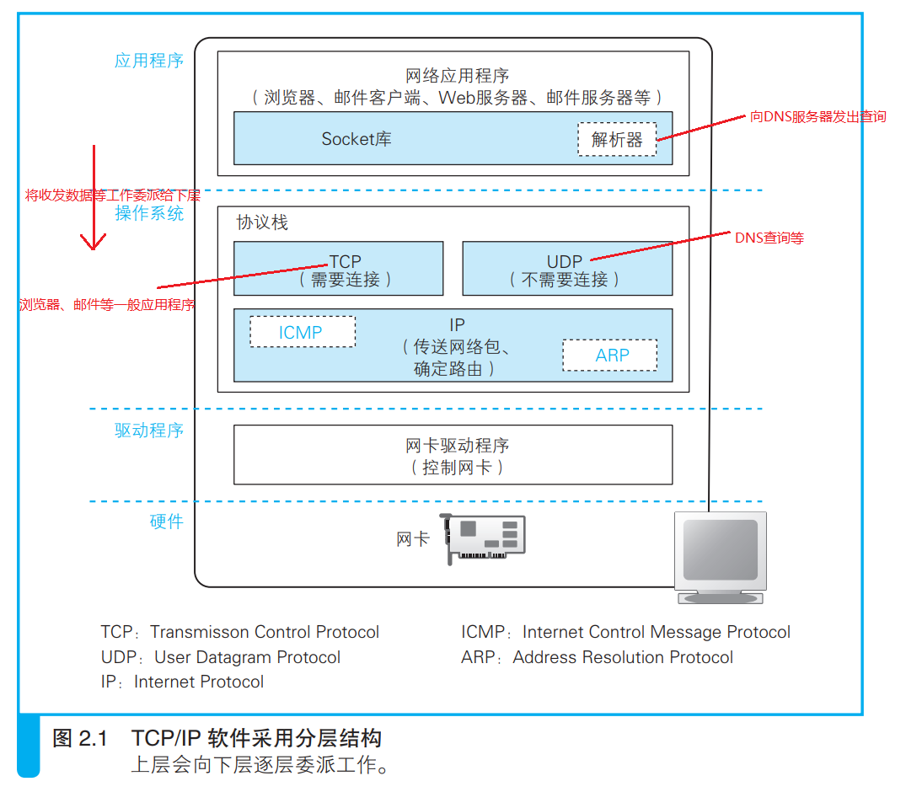
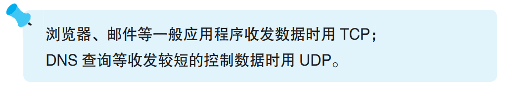
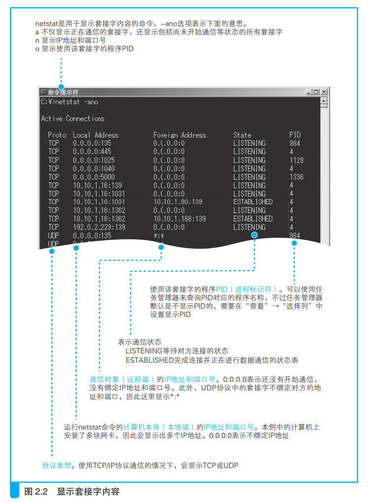
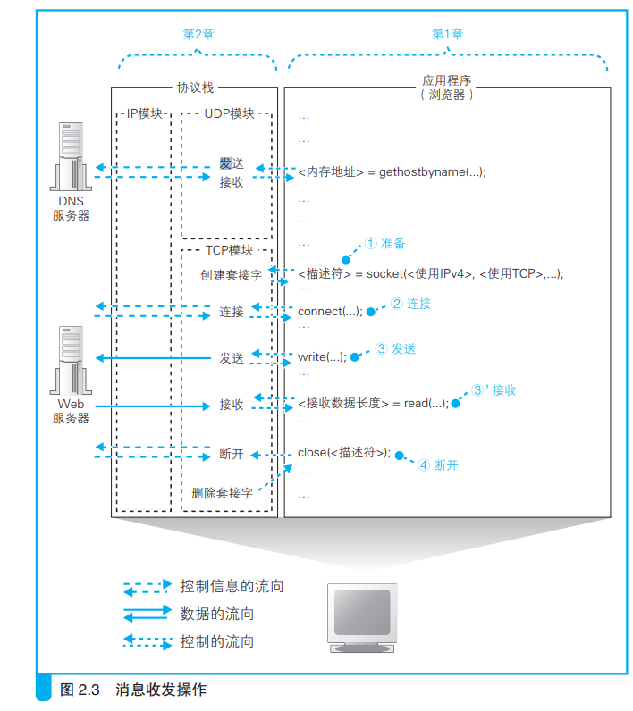

# 创建套接字

## 1. 协议栈的内部结构

&emsp;本章我们将探索操作系统中的网络控制软件（协议栈）和网络硬件（网 卡）是如何将浏览器的消息发送给服务器的。和浏览器不同的是，协议栈 的工作我们从表面上是看不见的，可能比较难以想象。因此，在实际探索 之前，我们先来对协议栈做个解剖，看看里面到底有些什么。 

&emsp;协议栈的内部如图 2.1 所示，分为几个部分，分别承担不同的功能。这张图中的上下关系是有一定规则的，上面的部分会向下面的部分委派工作，下面的部分接受委派的工作并实际执行，这一点大家在看图时可以参考一下。当然，这一上下关系只是一个总体的规则，其中也有一部分上下关系不明确，或者上下关系相反的情况，所以也不必过于纠结。此外，对 于图中的每个部分以及它们的工作方式，本章将按顺序进行介绍，因此对于里面的细节现在看不明白也没关系，只要大体上看出有哪些组成要素就可以了。

&emsp;下面我们从上到下来看一遍。图中最上面的部分是网络应用程序，也就是浏览器、电子邮件客户端、Web 服务器、电子邮件服务器等程序，它们会**将收发数据等工作委派给下层的部分来完成**。当然，除了浏览器之外，其他应用程序在网络上收发数据的操作也都是类似上面这样的，也就是说， 尽管不同的应用程序收发的数据内容不同，但收发数据的操作是共通的。 因此，下面介绍的内容不仅适用于浏览器，也适用于各种应用程序。

&emsp;应用程序的下面是 Socket 库，其中包括解析器，**解析器用来向 DNS 服务器发出查询**，它的工作过程我们在第 1 章已经介绍过了。 再下面就是操作系统内部了，其中包括协议栈。协议栈的上半部分有两块，分别是负责用 **TCP 协议收发数据的部分和负责用 UDP 协议收发数据的部分**，它们会接受应用程序的委托执行收发数据的操作。关于 TCP 和 UDP 我们将在后面讲解，现在大家只要先记住下面这句话就可以了：像浏览器、邮件等一般的应用程序都是使用 TCP 收发数据的，而像 DNS 查询等收发较短的控制数据的时候则使用 UDP。

&emsp;下面一半是用 IP 协议控制网络包收发操作的部分。在互联网上传送数据时，数据会被切分成一个一个的网络包（网络包：网络中的数据会被切分成几十字节到几千字节的小块，每一个小数据块被称为一个包。我们会在 2.5.1 节进行讲解），而将网络包发送给通信对象的操作就是由 IP 来负责的。此外，IP 中还包括 ICMPA 协议和 ARPB 协议。 

1. ICMP：用于告知网络包传送过程中产生的错误以及各种控制消息
2. ARP：用于根据 IP 地址查询相应的以太网 MAC 地址（符合 IEEE 规格的局域网设备都使用同一格式的地址，这种地址被称为 MAC 地址）。

&emsp;IP 下面的网卡驱动程序负责控制网卡硬件，而最下面的网卡则负责完 成实际的收发操作，也就是对网线中的信号执行发送和接收的操作

## 2. 套接字的实体就是通信控制信息

&emsp;我们已经了解了协议栈的内部结构，而对于在数据收发中扮演关键角 色的套接字，让我们来看一看它具体是个怎样的东西。 

&emsp;在协议栈内部有一块用于存放控制信息的内存空间，这里记录了用于 控制通信操作的控制信息，例如通信对象的 IP 地址、端口号、通信操作的 进行状态等。**本来套接字就只是一个概念而已，并不存在实体，如果一定要赋予它一个实体，我们可以说这些控制信息就是套接字的实体，或者说存放控制信息的内存空间就是套接字的实体**。

&emsp;协议栈在执行操作时需要参阅这些控制信息（这里的控制信息类似于我们在笔记本上记录的日程表和备忘录。我们可以根据笔记本上的日程表和备忘录来决定下一步应该做些什么，同样地，协议栈也是根据这些控制信息来决定下一步操作内容的）。例如，在发送数据时，需要看一看套接字中的通信对象 IP 地址和端口号，以便向指定的 IP 地址和端口发送数据。在发送数据之后，协议栈需要等待对方返回收到数据的响应信息，但数据也可能在中途丢失，永远也等不到对方的响应。在这样的情况下，我们不能一直等下去，需要在等待一定时间之后重新发送丢失 的数据，这就需要协议栈能够知道执行发送数据操作后过了多长时间。为 此，**套接字中必须要记录是否已经收到响应，以及发送数据后经过了多长时间，才能根据这些信息按照需要执行重发操作**。 

&emsp;上面说的只是其中一个例子。套接字中记录了用于控制通信操作的各 种控制信息，协议栈则需要根据这些信息判断下一步的行动，这就是套接 字的作用。

&emsp;讲了这么多抽象的概念，可能大家还不太容易理解，所以下面来看看 真正的套接字。在 Windows 中可以 netstat 命令显示套接字内容（图 2.2）（图中只显示了部分内容，除了图上的内容之外，套接字中还记录了其他很多种控制信息）。 图中每一行相当于一个套接字，当创建套接字时，就会在这里增加一行新 的控制信息，赋予“即将开始通信”的状态，并进行通信的准备工作，如分配用于临时存放收发数据的缓冲区空间。 

&emsp;既然有图，我们就来讲讲图上这些到底都是什么意思。比如第 8 行，它表示 PID（PID：Process ID（进程标识符）的缩写，是操作系统为了标识程序而分配的编号，使用任务管理器可以查询所对应的程序名称） 为 4 的程序正在使用 IP 地址为 10.10.1.16 的网卡与 IP 地址为 10.10.1.18 的对象进行通信。此外我们还可以看出，本机使用 1031 端口， 对方使用 139 端口，而 139 端口是 Windows 文件服务器使用的端口，因此 我们就能够看出这个套接字是连接到一台文件服务器的。我们再来看第 1 行，这一行表示 PID 为 984 的程序正在 135 端口等待另一方的连接，其中 本地 IP 地址和远程 IP 地址都是 0.0.0.0，这表示通信还没开始，IP 地址不确定（对于处于等待连接状态的套接字，也可以绑定 IP 地址，如果绑定了 IP 地址，那么除绑定的 IP 地址之外，对其他地址进行连接操作都会出错。当服务器上安装有多块网卡时，可以用这种方式来限制只能连接到特定的网卡）。

## 3.调用 socket 时的操作

&emsp;看过套接字的具体样子之后，我们的探索之旅将继续前进，看一看当浏览器调用 socket(socket：大写字母开头的 Socket 表示 Socket 库，而小写字母开头的 socket表示 Socket 库中名为 socket 的程序组件)、connect 等 Socket 库中的程序组件时，协议栈内部是如 何工作的。

&emsp;首先，我们再来看一下浏览器通过 Socket 库向协议栈发出委托的一系列操作（图 2.3）。这张图和介绍浏览器时用的那张图的内容大体相同，只 作了少许修改。正如我们之前讲过的那样，浏览器委托协议栈使用 TCP 协 议来收发数据(关于为什么要使用 TCP，以及 TCP 和 UDP 的区别，我们将在后面讲解)，因此下面的讲解都是关于 TCP 的。

&emsp;首先是创建套接字的阶段(图 2.3 最开始的调用 gethostbyname（解析器）向 DNS 服务器发送查询消息的部分在第 1 章关于 DNS 的内容中已经讲过，此处省略)。如图 2.3 ①所示，应用程序调用 socket 申请创建套接字，协议栈根据应用程序的申请执行创建套接字的操作。

&emsp;在这个过程中，协议栈首先会分配用于存放一个套接字所需的内存空间。用于记录套接字控制信息的内存空间并不是一开始就存在的，因此我 们先要开辟出这样一块空间来(计算机内部会同时运行多个程序，如果每个程序都擅自使用内存空间的 话，就有可能发生多个程序重复使用同一个内存区域导致数据损坏的问 题。为了避免出现这样的问题，操作系统中有一个“内存管理”模块，它相当于内存的管理员，负责根据程序的申请分配相应的内存空间，并确保这些内存空间不会被其他程序使用。因此，分配内存的操作就是向内存管 理模块提出申请，请它划分一块内存空间出来)，这相当于为控制信息准备一个容器。但光一个容器并没有什么用，还需要往里面存入控制信息。套接字刚刚创建时， 数据收发操作还没有开始，因此需要在套接字的内存空间中写入表示这一初始状态的控制信息。到这里，创建套接字的操作就完成了。

&emsp;接下来，需要将表示这个套接字的**描述符**告知应用程序。描述符相当于用来区分协议栈中的多个套接字的号码牌。

&emsp;收到描述符之后，应用程序在向协议栈进行收发数据委托时就需要提 供这个描述符。由于套接字中记录了通信双方的信息以及通信处于怎样的 状态，所以只要通过描述符确定了相应的套接字，协议栈就能够获取所有 的相关信息，这样一来，应用程序就不需要每次都告诉协议栈应该和谁进 行通信了。