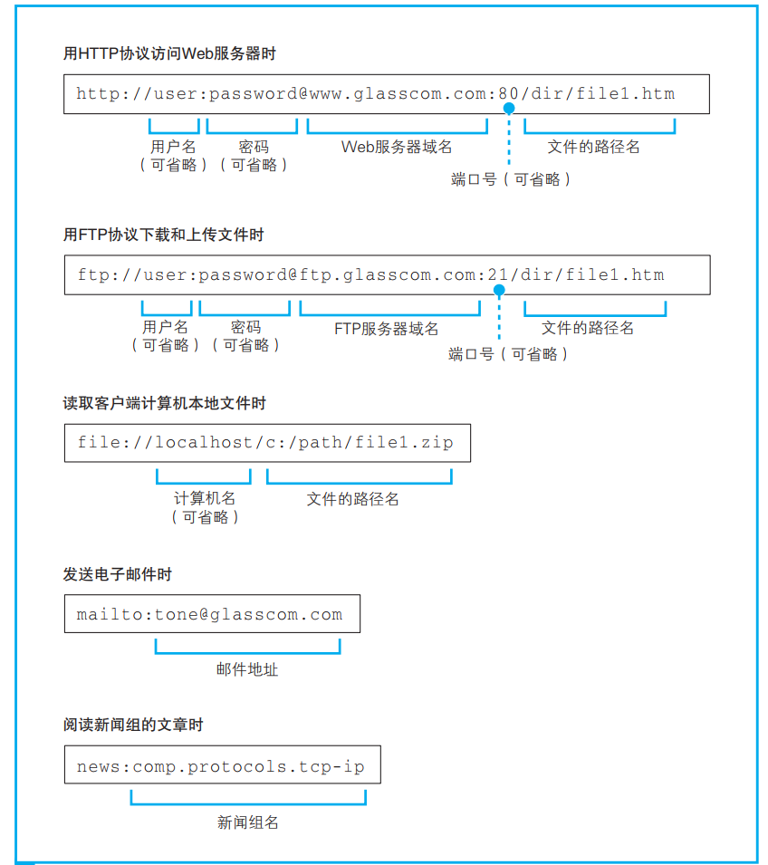
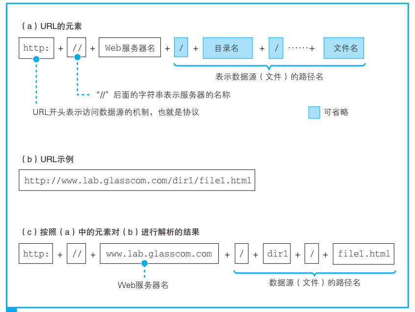
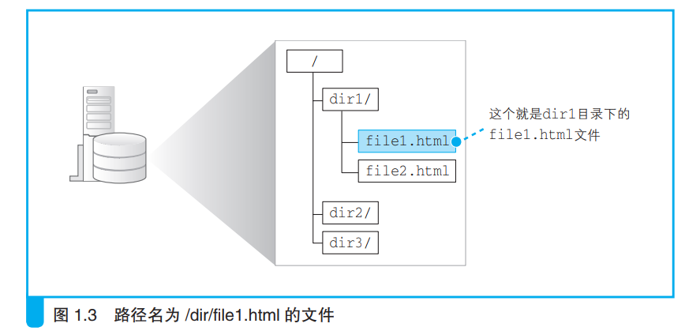
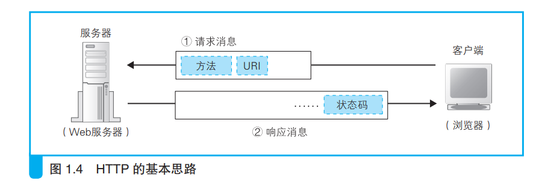
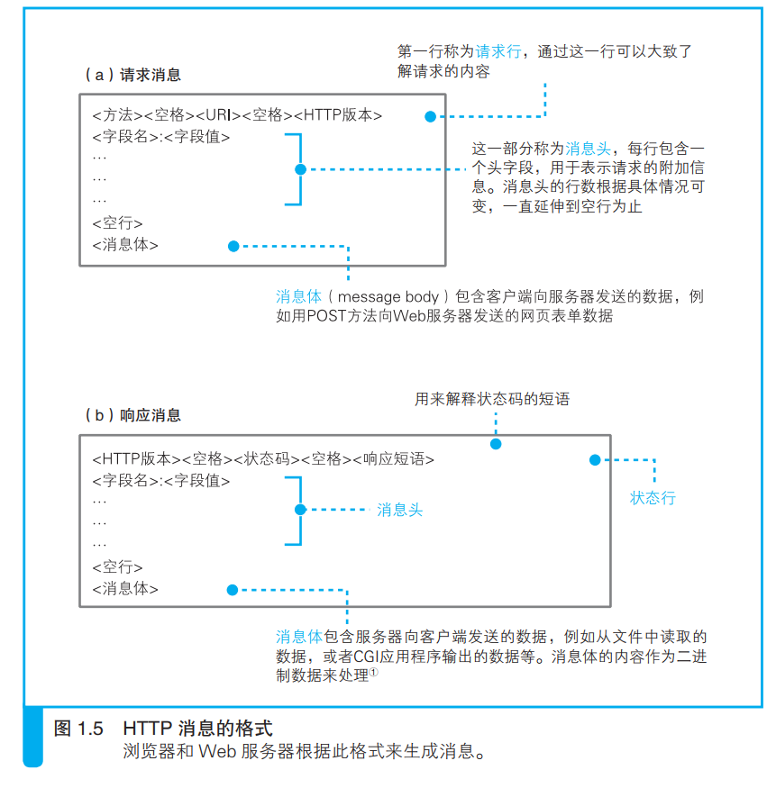
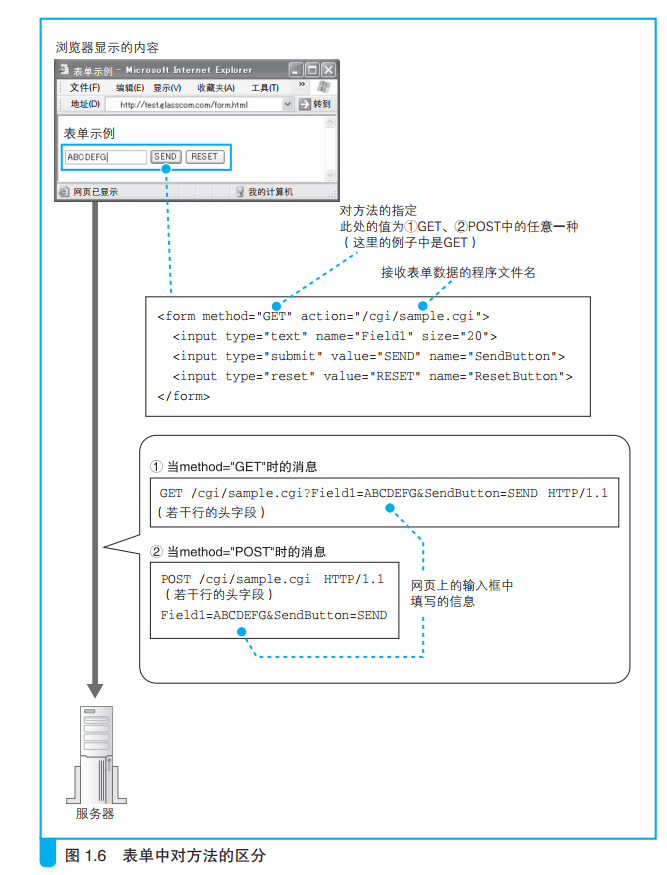
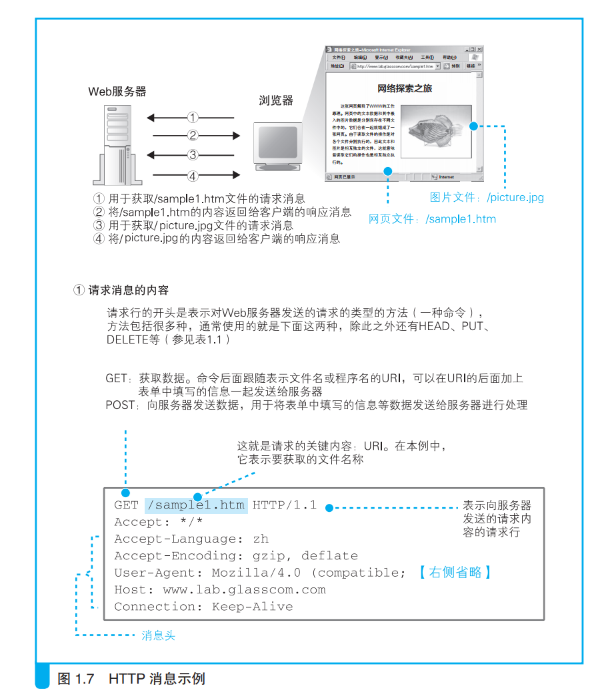
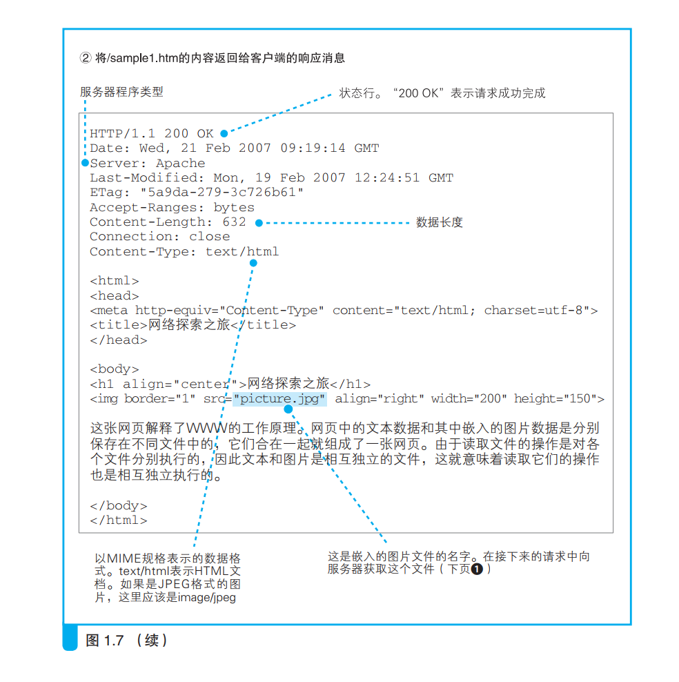
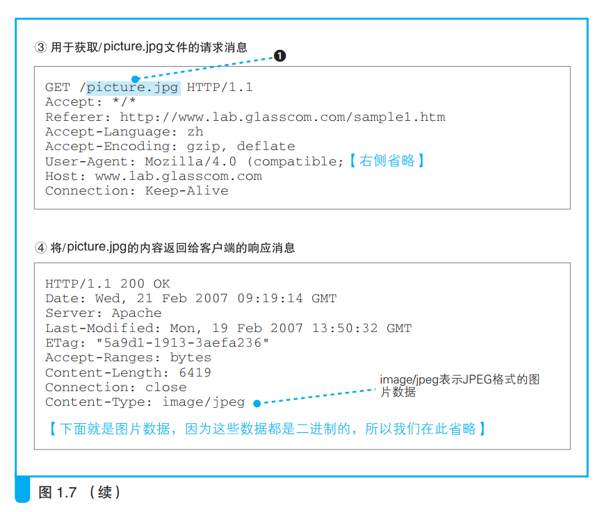

| 英文缩写 | 英文全称                    | 中文含义       |
| -------- | --------------------------- | -------------- |
| URL      | Uniform Resource Locator    | 统一资源定位符 |
| FTP      | File Transfer Protocol      | 文件传送协议   |
| HTTP     | Hypertext Transfer Protocol | 超文本传送协议 |
| URI      | Uniform Resource Identifier | 统一资源标识符 |
| CGI      | Common Gateway Interface    | 公共网关接口   |

## 一、浏览器的第一步：URL解析:

### 1.1 URL简介

&emsp;URL是因特网的万维网服务程序上用于指定信息位置的表示方法，网址也是使用的URL表示方法，而URL规定网址需要以http://来开头，但是URL还可以定位很多其他内容，比如说使用“file:” 开头来定位计算机本地的文件（不妨尝试使用chrome来打开本地的一个PDF文件），比如说使用“ftp:” 来访问FTP服务器。URL， 根据访问目标的不同，URL 的写法也会不同，如下图所示：可以说浏览器可以做很多事，不仅仅用来浏览网页~

&emsp;由上图可见， 根据需要， URL 中还会包含用户名、 密码、服务器端口号等信息。 端口号： 1.4.3 节和第 6 章的 6.1.3 节有详细说明，这里请大家理解为一个**用来识别要连接的服务器程序的编号**。不同的服务器程序会使用不同的编号，例如 Web 是 80，邮件是 25 等。 

小结：

&emsp;尽管 URL 有各种不同的写法， 但它们有一个共同点， 那就是 URL 开头的文字， 即“http:”“ftp:”“file:”“mailto:” 这部分文字都**表示浏览器应当使用的访问方法**。 比如当访问 Web 服务器时应该使用 HTTP 协议， 而访问 FTP 服务器时则应该使用 FTP 协议。 因此， 我们可以把这部分理解为访问时使用的协议 B 类型 C。 尽管后面部分的写法各不相同， 但开头部分的内容决定了后面部分的写法， 因此并不会造成混乱。 

### 1.2 浏览器解析 URL 

**&emsp;浏览器要做的第一步工作就是对 URL 进行解析**， 从而生成发送给 Web服务器的请求消息。 刚才我们已经讲过， URL 的格式会随着协议的不同而不同， 因此下面我们以访问 Web 服务器的情况为例来进行讲解。 

&emsp;根据 HTTP 的规格， URL 包含下图中的这几种元素（a） ：

&emsp;当对 URL进行解析时， 首先需要按照上图表示的格式将其中的各个元素拆分出来(c)， 然后， 通过拆分出来
的这些元素， 我们就能够明白 URL 代表的含义。 例如， 我们来看拆分结果图 (c)， 其中包含 Web 服务器名称 www.lab.glasscom.com， 以及文件的路径名 /dir1/file1.html， 因此我们就能够明白， 图 （ b） 中的 URL 表示要访问 www.lab.glasscom.com 这个 Web 服务器上路径名为 /dir/file1.html 的文件， 也就是位于 /dir/ 目录 D 下的 file1.html 这个文件,如下图：

### 1.3 省略文件名的情况下浏览器解析URL

`（ a） http://www.lab.glasscom.com/dir/ `

&emsp;上面的URL（学了计算机网络就不要再说其为网址了！！！）是以“/” 来结尾的。我们可以这样理解， 以“/” 结尾代表 /dir/ 后面本来应该有的文件名被省略了。 根据 URL 的规则， 文件名可以像前面这样省略。 

&emsp;不过， 没有文件名， 服务器怎么知道要访问哪个文件呢？ 其实， 我们会在服务器上事先设置好文件名省略时要访问的默认文件名。 这个设置根据服务器不同而不同， 大多数情况下是`index.html`或者`default.htm`之类的
文件名。 因此， 像前面这样省略文件名时， 服务器就会访问`/dir/index.html`或者`/dir/default.htm`。

&emsp;还有一些 URL 是像下面这样只有 Web 服务器的域名的， 这也是一种省略了文件名的形式。 

`（ b） http://www.lab.glasscom.com/ `

&emsp;这个 URL 也是以“/” 结尾的， 也就是说它表示访问一个名叫“/” 的目录(学过Linux的话，你一定知道其就是根目录的含义)。 而且， 由于省略了文件名， 所以结果就是访问 /index.html 或者/default.htm 这样的文件了。 

&emsp;那么， 下面这个 URL 又是什么意思呢？

`（ c） http://www.lab.glasscom.com`

&emsp;这次连结尾的“/” 都省略了。 像这样连目录名都省略时， 真不知道到底在请求哪个文件了， 实在有些过分。 不过， 这种写法也是允许的。 **当没有路径名时， 就代表访问根目录下事先设置的默认文件**， 也就是 /index.
html 或者 /default.htm 这些文件， 这样就不会发生混乱了。 

&emsp;不过， 下面这个例子就更诡异了。
`（ d） http://www.lab.glasscom.com/whatisthis`
&emsp;前面这个例子中， 由于末尾没有“/”， 所以 whatisthis 应该理解为文件名才对。 但实际上， 很多人并没有正确理解省略文件名的规则， 经常会把目录末尾的“/” 也给省略了。 因此， 或许我们不应该总是将 whatisthis 作为文件名来处理（在一个目录下，我们无法创建两个名字相同的文件和目录，因此不可能既有一个名为whatisthis 的文件，同时又有一个名为 whatisthis 的目录。只要查询一下磁盘中的文件和目录，就可以知道 whatisthis 究竟是一个文件还是一个目录了，并不会产生歧义 ）。 一般来说， 这种情况会按照下面的惯例进行处理： **如果Web 服务器上存在名为 whatisthis 的文件， 则将 whatisthis 作为文件名来处理； 如果存在名为 whatisthis 的目录， 则将 whatisthis 作为目录名来处理。** 

## 二、HTTP 的基本思路 

&emsp;解析完 URL 之后， 我们就知道应该要访问的目标在哪里了。 接下来，浏览器会使用 HTTP 协议来访问 Web 服务器， 不过在介绍这一环节之前， 我们先来讲一讲 HTTP 协议到底是怎么回事。 

### 2.1 HTTP 的基本知识 

&emsp;除了图 1.4 中的内容之外， HTTP 消息中还有一些用来表示附加信息的头字段。 客户端向 Web 服务器发送数据时， 会先发送头字段， 然后再发送数据。 不过，**头字段属于可有可无的附加信息**， 因此我们留到后面再讲。 

HTTP 协议定义了客户端和服务器之间交互的消息内容和步骤， 其基本思路非常简单，可以用如下步骤表示：

1. 首先， 客户端会向服务器发送请求消息，请求消息中包含的内容是“对什么” 和“进行怎样的操作” 两个部分 ：
   1. 对什么” 的部分称为 URI ，一般来说， URI 的内容是一个存放网页数据的文件名或者是一个 CGI 程序的文件名， 例如“ /dir1/file1.html”，“/dir1/program1.cgi” 等(实际上，这个文件在 Web 服务器上未必是真实存在的，因为 Web 服务器可以通过重写规则对虚拟的 URI 进行映射 )。 不过， URI 不仅限于此， 也可以直接使用“http:”开头的URL来作为URI。 换句话说就是， 这里可以写各种访问目标， 而这些访问目标统称为 URI。 
   2. “进行怎样的操作” 的部分称为方法 。 方法表示需要让Web 服务器完成怎样的工作， 其中典型的例子包括读取 URI 表示的数据、将客户端输入的数据发送给 URI 表示的程序等。 表 1.1 列举了主要的方法，通过这张表大家应该能够理解通过方法可以执行怎样的操作。 
2. 收到请求消息之后， Web 服务器会对其中的内容进行解析， 通过 URI和方法来判断“对什么”“进行怎样的操作”， 并根据这些要求来完成自己的工作， 然后将结果存放在响应消息中。 
3. 在响应消息的开头有一个状态码，它用来表示操作的执行结果是成功还是发生了错误。 当我们访问 Web 服务器时， 遇到找不到的文件就会显示出 404 Not Found 的错误信息， 其实这就是状态码。 状态码后面就是头字段和网页数据。 响应消息会被发送回客户端， 客户端收到之后， 浏览器会从消息中读出所需的数据并显示在屏幕上。 到这里， HTTP 的整个工作就完成了。 

表 1.1　HTTP 的主要方法

| 方法    | HTTP 版本 | HTTP 版本 | 含　　义                                                     |
| ------- | --------- | --------- | ------------------------------------------------------------ |
|         | 1.0       | 1.1       |                                                              |
| GET     | ○         | ○         | 获取 URI 指定的信息。如果 URI 指定的是文件，则 返回文件的内容；如果 URI 指定的是 CGI 程序，则 返回该程序的输出数据 |
| POST    | ○         | ○         | 从客户端向服务器发送数据。一般用于发送表单中 填写的数据等情况下 |
| HEAD    | ○         | ○         | 和 GET 基本相同。不过它只返回 HTTP 的消息头 （message header），而并不返回数据的内容。用于 获取文件最后更新时间等属性信息 |
| OPTIONS | ○         |           | 用于通知或查询通信选项                                       |
| PUT     | △         | ○         | 替换 URI 指定的服务器上的文件。如果 URI 指定的 文件不存在，则创建该文件 |
| DELETE  | △         | ○         | 删除 URI 指定的服务器上的文件                                |
| TRACE   | ○         |           | 将服务器收到的请求行和头部（header）直接返回 给客户端。用于在使用代理的环境中检查改写请求的情况 |
| CONNECT | ○         |           | 使用代理传输加密消息时使用的方法                             |

○：在该版本的规格中定义的项目。
△：并非正式规格，而是在规格书附录（Appendix）中定义的附加功能。
　 上述 1.0 版本和 1.1 版本的描述分别基于 RFC1945 和 RFC2616。

&emsp;收到请求消息之后， Web 服务器会对其中的内容进行解析， 通过 URI和方法来判断“对什么”,“进行怎样的操作”， 并根据这些要求来完成自己的工作， 然后将结果存放在响应消息中。 在响应消息的开头有一个状态码，它用来表示操作的执行结果是成功还是发生了错误。 当我们访问 Web 服务器时， 遇到找不到的文件就会显示出 404 Not Found 的错误信息， 其实这就是状态码。 状态码后面就是头字段和网页数据。 响应消息会被发送回客户端， 客户端收到之后， 浏览器会从消息中读出所需的数据并显示在屏幕上。 到这里， HTTP 的整个工作就完成了。 

&emsp;现在大家应该已经了解了 HTTP 的全貌， 下面我们再补充一些关于HTTP 方法的知识。 表 1.1 列出的方法中， 最常用的一个就是 GET 方法了。一般当我们访问 Web 服务器获取网页数据时， 使用的就是 GET 方法。 所谓一般的访问过程大概就是这样的： 首先， 在请求消息中写上 GET 方法，然后在 URI 中写上存放网页数据的文件名“/dir1/file1.html”， 这就表示我们需要获取 /dir1/file1.html 文件中的数据。 当 Web 服务器收到消息后， 会
打开 /dir1/file1.html 文件并读取出里面的数据， 然后将读出的数据存放到响应消息中， 并返回给客户端。 最后， 客户端浏览器会收到这些数据并显示在屏幕上。
&emsp;还有一个经常使用的方法就是 POST。 我们在表单中填写数据并将其发送给 Web 服务器时就会使用这个方法。 当我们在网上商城填写收货地址和姓名， 或者是在网上填写问卷时， 都会遇到带有输入框的网页， 而这些可以输入信息的部分就是表单。 使用 POST 方法时， URI 会指向 Web 服务器中运行的一个应用程序的文件名， 典型的例子包括“index.cgi”,“index.php” 等。 然后， 在请求消息中， 除了方法和 URI 之外， 还要加上传递给应用程序和脚本的数据。 这里的数据也就是用户在输入框里填写的信息。当服务器收到消息后， Web 服务器会将请求消息中的数据发送给 URI 指定的应用程序。 最后， Web 服务器从应用程序接收输出的结果， 会将它存放到响应消息中并返回给客户端。 

&emsp;前面两个方法属于 HTTP 的典型用法， 除此之外的其他方法在互联网上几乎见不到使用的例子。 因此， 只要理解了这两个方法， 就能够应付大部分情况了， 但如果可以， 还是推荐大家看一看表 1.1 中所有方法的说明， 思考一下它们的含义， 以便理解 HTTP 协议具备的所有功能。 如果只有GET 和 POST 方法， 我们就只能从 Web 服务器中获取网页数据， 以及将网页输入框中的信息发送给 Web 服务器， 而有了 PUT 和 DELETE 方法， 就能够从客户端修改或者删除 Web 服务器上的文件。 有了这些功能， 我们甚至可以将 Web 服务器当成文件服务器来用。 当然， 出于安全上的原因， 或者是支持 GET 和 POST 之外的方法的客户端没有广泛普及之类的原因， 一般我们并不会碰到这样的用法（如果能够规避安全问题，例如将访问限制在公司内部网络，那么这种用法还是有效的。（实际上， PUT、 DELETE 等方法现在常用于 RESTful API 的设计中，在手机 App 和后端服务器交互时就会经常用到。 ）， 但大家应该能够看出， HTTP 协议其实蕴藏着很多的可能性。 

### 2.2 浏览器如何生成HTTP请求消息

&emsp;理解了 HTTP 的基本知识之后， 让我们回到对浏览器本身的探索中来。对 URL 进行解析之后， 浏览器确定了 Web 服务器和文件名， 接下来就是根据这些信息来生成 HTTP 请求消息了。 实际上， HTTP 消息在格式上是有严格规定的， 因此浏览器会按照规定的格式来生成请求消息 。注意：下面`<...>`只是表示单个内容，并不是指真实的HTTP消息本身在格式上都需要使用`<>`来隔开，一般使用空格隔开即可。

&emsp;首先， 请求消息的第一行称为请求行。 这里的重点是最开头的方法，方法可以告诉 Web 服务器它应该进行怎样的操作。 不过这里必须先解决一个问题， 那就是**方法有很多种， 我们必须先判断应该选用其中的哪一种。**解决这个问题的关键在于浏览器的工作状态。 这次探索之旅是从在浏览器顶部的地址栏中输入网址开始的， 但浏览器并非只有在这一种场景下才会向 Web 服务器发送请求消息。 比如点击网页中的超级链接(在 HTML 文档中写上 `<a href="……">` 标签，其中 "……" 部分为 URL，这就是一个超级链接)， 或者在表单中填写信息后点击“提交” 按钮， 这些场景都会触发浏览器的工作， 而选用哪种方法也是根据场景来确定的。 

&emsp;我们的场景是在地址栏中输入网址并显示网页， 因此这里应该使用 GET方法。 点击超级链接的场景中也是使用 GET 方法。 如果是表单， 在 HTML源代码中会在表单的属性中指定使用哪种方法来发送请求， 可能是 GET 也
可能是 POST（ 图 1.6）  

&emsp;写好方法之后， 加一个空格， 然后写 URI。 URI 部分的格式如下， 一般是文件和程序的路径名。 

`/< 目录名 >/…/< 文件名 > `

&emsp;前面已经讲过， 路径名一般来说已经包含在 URL 中了， 因此只要从URL 中提取出来原封不动地写上去就好了。
&emsp;第一行的末尾需要写上 HTTP 的版本号， 这是为了表示该消息是基于哪个版本的 HTTP 规格编写的。 到此为止，第一行就结束了。

&emsp;第二行开始为消息头。 尽管通过第一行我们就可以大致理解请求的内容， 但有些情况下还需要一些额外的详细信息， 而消息头的功能就是用来存放这些信息。 **消息头的规格中定义了很多项目， 如日期、 客户端支持的数据类型、 语言、 压缩格式、 客户端和服务器的软件名称和版本、 数据有效期和最后更新时间等。** 这些项目表示的都是非常细节的信息， 因此要想准确理解这些信息的意思， 就需要对 HTTP 协议有非常深入的了解。 表 1.2中**列举了主要的头字段**供大家参考， 但不必全部弄明白。 消息头中的内容随着浏览器类型、 版本号、 设置等的不同而不同， 大多数情况下消息头的长度为几行到十几行不等。

&emsp;写完消息头之后， 还需要添加一个完全没有内容的空行， 然后写上需要发送的数据。 这一部分称为消息体， 也就是消息的主体。 不过， 在使用GET 方法的情况下， 仅凭方法和 URI， Web 服务器就能够判断需要进行怎样的操作， 因此消息体中不需要填写任何数据。 消息体结束之后，整个消息也就结束了。

表 1.2　HTTP 中主要的头字段

| 头字段类型                           | HTTP 版本 | HTTP 版本 | 含　　义                                        |
| ------------------------------------ | --------- | --------- | ----------------------------------------------- |
|                                      | 1.0       | 1.1       |                                                 |
| 通用头：适用于请求和响应消息的头字段 |           |           |                                                 |
| Date                                 | ○         | ○         | 表示请求和响应生成的日期                        |
| Pragma                               | ○         | ○         | 表示数据是否允许缓存的通信选项                  |
| Cache-Control                        | ○         |           | 控制缓存的相关信息                              |
| Connection                           | ○         |           | 设置发送响应之后 TCP 连接是否继续保持的通信选项 |

| 头字段类型                                 | HTTP 版本 | HTTP 版本 | 含　　义                                                     |
| ------------------------------------------ | --------- | --------- | ------------------------------------------------------------ |
|                                            | 1.0       | 1.1       |                                                              |
| Transfer-Encoding                          | ○         |           | 表示消息主体的编码格式                                       |
| Via                                        | ○         |           | 记录途中经过的代理和网关                                     |
| 请求头：用于表示请求消息的附加信息的头字段 |           |           |                                                              |
| Authorization                              | ○         | ○         | 身份认证数据                                                 |
| From                                       | ○         | ○         | 请求发送者的邮件地址                                         |
| If-Modified-Since                          | ○         | ○         | 如果希望仅当数据在某个日期之后有更新时才执 行请求，可以在这个字段指定希望的日期。一般 来说，这个功能的用途在于判断客户端缓存的数 据是否已经过期，如果已经过期则获取新的数据 |
| Referer                                    | ○         | ○         | 当通过点击超级链接进入下一个页面时，在这里 会记录下上一个页面的 URI |
| User-Agent                                 | ○         | ○         | 客户端软件的名称和版本号等相关信息                           |
| Accept                                     | △         | ○         | 客 户 端 可 支 持 的 数 据 类 型（Content-Type）， 以 MIME 类型来表示 |
| Accept-Charset                             | △         | ○         | 客户端可支持的字符集                                         |
| Accept-Encoding                            | △         | ○         | 客户端可支持的编码格式（Content-Encoding）， 一般来说表示数据的压缩格式 |
| Accept-Language                            | △         | ○         | 客户端可支持的语言，汉语为 zh，英语为 en                     |
| Host                                       | ○         |           | 接收请求的服务器 IP 地址和端口号                             |
| If-Match                                   | ○         |           | 参见 Etag                                                    |
| If-None-Match                              | ○         |           | 参见 Etag                                                    |
| If-Unmodified-Since                        | ○         |           | 当指定日期之后数据未更新时执行请求                           |
| Range                                      | ○         |           | 当需要只获取部分数据而不是全部数据时，可通 过这个字段指定要获取的数据范围 |
| 响应头：用于表示响应消息的附加信息的头字段 |           |           |                                                              |
| Location                                   | ○         | ○         | 表示信息的准确位置。当请求的 URI 为相对路径 时，这个字段用来返回绝对路径 |
| Server                                     | ○         | ○         | 服务器程序的名称和版本号等相关信息                           |

| 头字段类型                                       | HTTP 版本 | HTTP 版本 | 含　　义                                                     |
| ------------------------------------------------ | --------- | --------- | ------------------------------------------------------------ |
|                                                  | 1.0       | 1.1       |                                                              |
| WWW-Authenticate                                 | ○         | ○         | 当请求的信息存在访问控制时，返回身份认证用 的数据（Challenge ①） |
| Accept-Ranges                                    | ○         |           | 当希望仅请求部分数据（使用 Range 来指定范围） 时，服务器会告知客户端是否支持这一功能 |
| 实体头：用于表示实体（消息体）的附加信息的头字段 |           |           |                                                              |
| Allow                                            | ○         | ○         | 表示指定的 URI 支持的方法                                    |
| Content-Encoding                                 | ○         | ○         | 当消息体经过压缩等编码处理时，表示其编码格式                 |
| Content-Length                                   | ○         | ○         | 表示消息体的长度                                             |
| Content-Type                                     | ○         | ○         | 表示消息体的数据类型，以 MIME 规格定义的数 据类型来表示      |
| Expires                                          | ○         | ○         | 表示消息体的有效期                                           |
| Last-Modified                                    | ○         | ○         | 数据的最后更新日期                                           |
| Content-Language                                 | ○         |           | 表示消息体的语言。汉语为 zh，英语为 en                       |
| Content-Location                                 | ○         |           | 表示消息体在服务器上的位置（URI）                            |
| Content-Range                                    | ○         |           | 当仅请求部分数据时，表示消息体包含的数据范围                 |
| Etag                                             | ○         |           | 在更新操作中，有时候需要基于上一次请求的响应 数据来发送下一次请求。在这种情况下，这个字段 可以用来提供上次响应与下次请求之间的关联信息。 上次响应中，服务器会通过 Etag 向客户端发送一 个唯一标识，在下次请求中客户端可以通过 If Match、If-None-Match、If-Range 字段将这个标识 告知服务器，这样服务器就知道该请求和上次的响 应是相关的。这个字段的功能和 Cookie 是相同的， 但 Cookie 是网景（Netscape）公司自行开发的规格， 而 Etag 是将其进行标准化后的规格 |

○：在规格中定义的项目。
△：并非正式规格，而是在规格书附录（Appendix）中定义的附加功能 

当使用 POST 方法时， 需要将表单中填写的信息写在消息体中。 到此为止， 请求消息的生成操作就全部完成了。 

### 2.3 浏览器在发送请求后会收到响应 

&emsp;当我们将上述请求消息发送出去之后， Web 服务器会返回响应消息。关于响应消息我们将在第 6 章详细介绍， 这里先粗略地了解一下。 响应消息的格式以及基本思路和请求消息是相同的（ 图 1.5（ b））， 差别只在第一行
上。 **在响应消息中， 第一行的内容为状态码和响应短语， 用来表示请求的执行结果是成功还是出错**。状态码和响应短语表示的内容一致， 但它们的用途不同。状态码是一个数字，它主要用来**向程序告知执行的结果**（ 表
1.3）； 相对地，响应短语则是一段文字，用来**向人们告知执行的结果** 。

表 1.3　HTTP 状态码概要
状态码的第一位数字表示状态类型，第二、三位数字表示具体的情况。下表列举了第一位数字的含义。 

| 状态码 | 含　　义                 |
| ------ | ------------------------ |
| 1xx    | 告知请求的处理进度和情况 |
| 2xx    | 成功                     |
| 3xx    | 表示需要进一步操作       |
| 4xx    | 客户端错误               |
| 5xx    | 服务器错误               |

&emsp;返回响应消息之后， 浏览器会将数据提取出来并显示在屏幕上， 我们就能够看到网页的样子了。

&emsp;如果网页的内容只有文字， 那么到这里就全部处理完毕了。

&emsp;但如果网页中还包括图片等资源， 则还有下文。当网页中包含图片时，会在网页中的相应位置嵌入表示图片文件的标签的控制信息。浏览器会在显示文字时搜索相应的标签（标签：编写网页所使用的 HTML 语言中规定的控制信息。例如，当需要在网页中插入图片时，需要在相应位置嵌入形如` `的标签。 ），**当遇到图片相关的标签时，会在屏幕上留出用来显示图片的空间**， 然后再次访问 Web 服务器， 按照标签中指定的文件名向 Web 服务器请求获取相应的图片并显示在预留的空间中。 这个步骤和获取网页文件时一样， 只要在 URI 部分写上图片的文件名并生成和发送请求消息就可以了 由于每条请求消息中只能写 1 个 URI， 所以每次只能获取 1 个文件，
**&emsp;如果需要获取多个文件， 必须对每个文件单独发送 1 条请求。** 比如 1 个网页中包含 3 张图片，那么获取网页加上获取图片，一共需要向 Web 服务器发送 4 条请求。
&emsp;判断所需的文件，然后获取这些文件并显示在屏幕上，这一系列工作的整体指挥也是浏览器的任务之一，而 Web 服务器却毫不知情。**Web 服务器完全不关心这 4 条请求获取的文件到底是 1 个网页上的还是不同网页上**
**的，它的任务就是对每一条单独的请求返回 1 条响应而已。**
&emsp;到这里，我们已经介绍了浏览器与 Web 服务器进行交互的整个过程。作为参考，图 1.7 展示了浏览器与 Web 服务器之间交互消息的一个实例。在这个例子中，我们需要获取一张名为 sample1.htm 的网页， 网页中包含一张名为 picture.jpg 的图片，图中展示了这个过程中产生的消息。 

[第二章：IP 地址的基本知识](https://github.com/Spongecaptain/Computer-Network-Notes/blob/master/第二章%20IP%20地址的基本知识.md)

