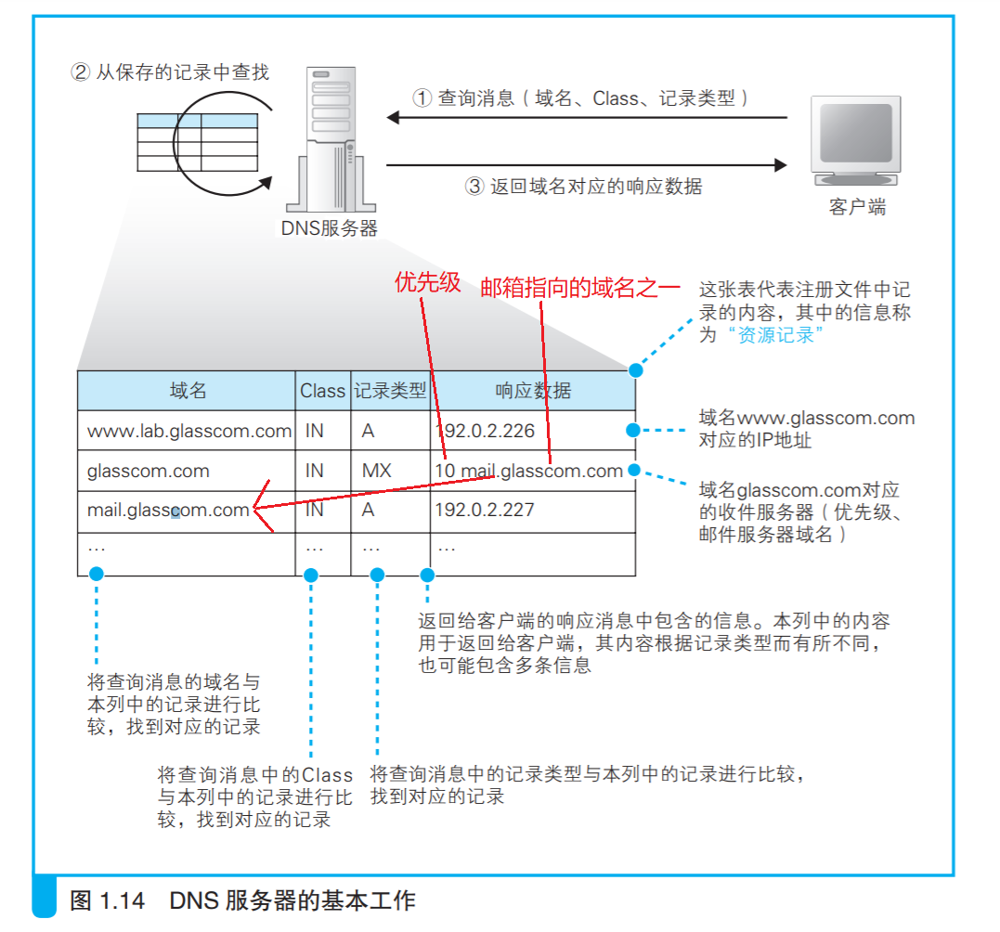
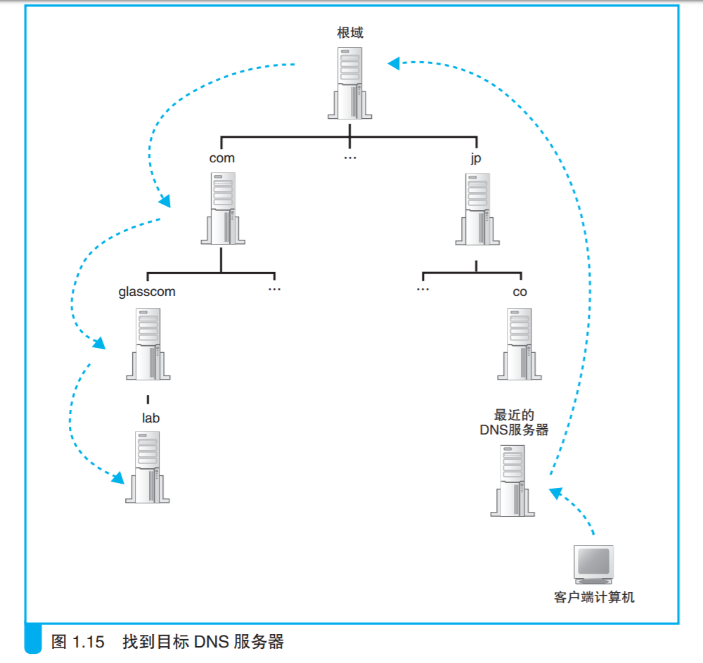
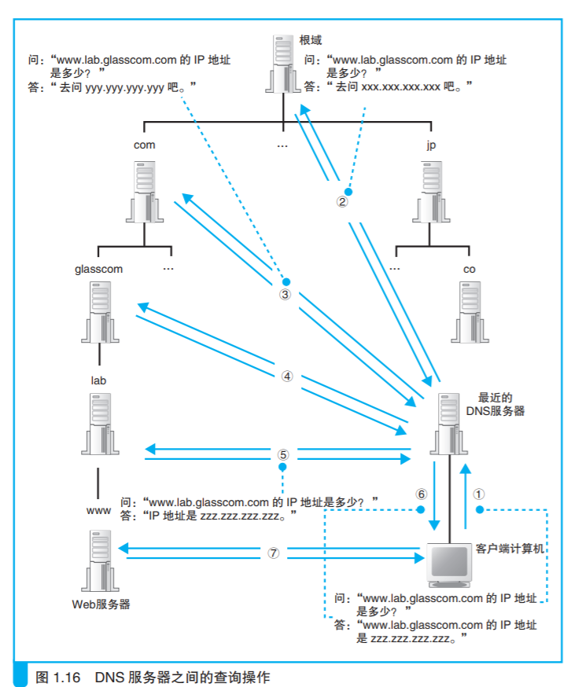

## 一、DNS 服务器的基本工作

&emsp;前文介绍了解析器与 DNS 服务器之间的交互过程，下面来了解一下DNS 服务器的工作。DNS 服务器的**基本工作就是接收来自客户端的查询消息，然后根据消息的内容返回响应。**
其中，来自客户端的查询消息包含以下 3 种信息。

| 信息名   | 具体内容                                                     |
| -------- | ------------------------------------------------------------ |
| 域名     | 服务器、邮件服务器（邮件地址中 @ 后面的部分）的名称          |
| Class    | 在最早设计 DNS 方案时，DNS 在互联网以外的其他网络中的应用也被考虑到了，而 Class 就是用来识别网络的信息。不过，如今除了互联网并没有其他的网络了，因此 Class 的值永远是代表互联网的 IN |
| 记录类型 | 表示域名对应何种类型的记录。例如，当类型为 A 时，表示域名对应的是 IP 地址；当类型为 MX 时，表示域名对应的是邮件服务器。对于不同的记录类型，服务器向客户端返回的信息也会不同 |

&emsp;DNS 服务器上事先保存有前面这 3 种信息对应的记录数据，如图 1.14所示。DNS 服务器就是根据这些记录查找符合查询请求的内容并对客户端作出响应的。

&emsp;例如，如果要查询 www.lab.glasscom.com 这个域名对应的 IP 地址，客户端会向 DNS 服务器发送包含以下信息的查询消息：
（a）域名 = www.lab.glasscom.com
（b） Class = IN
（c）记录类型 = A

&emsp;然后，DNS 服务器会从已有的记录中查找域名、Class 和记录类型全部匹配的记录。假如 DNS 服务器中的记录如图 1.14 所示，那么第一行记录与查询消息中的 3 个项目完全一致。于是，DNS 服务器会将记录中的192.0.2.226 这个值返回给客户端。然而，Web 服务器的域名有很多都是像www.lab.glasscom.com 。这样以 www 开头的，但这并不是一定之规，只是因为最早设计 Web 的时候，很多 Web 服务器都采用了 www 这样的命名，后来就形成了一个惯例而已。因此，无论是 WebServer1 也好，MySrv 也好，只要是作为 A（A 是 Address 的缩写）记录在 DNS 服务器上注册的，都可以作为 Web 服务器的域名(不仅是 Web 服务器，像邮件服务器、数据库服务器等，无论任何服务器，只要注册了 A 类型的记录，都可以作为服务器的域名来使用。准确来说，A 类型的记录表示与 IP 地址所对应的域名，因此与其说是某个服务器的域名，不如说是被分配了某个 IP 地址的某台具体设备的域名。)。
&emsp;在查询 IP 地址时我们使用 A 这个记录类型，而查询邮件服务器时则要使用 MX(MX：Mail eXchange，邮件交换)类型。这是因为在 DNS 服务器上，IP 地址是保存在 A 记录中的，而邮件服务器则是保存在 MX 记录中的。例如，对于一个邮件地址tone@glasscom.com，当需要知道这个地址对应的邮件服务器时，我们需要提供 @ 后面的那一串名称。查询消息的内容如下。

（a）域名 = glasscom.com
（b） Class = IN
（c）记录类型 = MX

&emsp;DNS 服务器会返回 10(服务器优先级) 和 mail.glasscom.com 这两条信息。当记录类型为 MX 时，DNS 服务器会在记录中保存两种信息，分别是邮件服务器的域名和优先级(当一个邮件地址对应多个邮件服务器时，需要根据优先级来判断哪个邮件服务器是优先的。优先级数值较小的邮件服务器代表更优先)。此外，MX 记录的返回消息还包括邮件服务器 mail.glasscom.com 的 IP 地址。上表的第三行就是 mail.glasscom.com 的 IP 地址，因此只要用 mail.glasscom.com 的域名就可以找到这条记录。在这个例子中，我们得到的 IP 地址是 192.0.2.227。

&emsp;综上所述，DNS 服务器的基本工作就是根据需要查询的**域名**和**记录类型**查找相关的记录，并向客户端返回响应消息，并且有一个域名可以指向另一个域名的形式，需要经过多次映射查询才能找到对应的IP地址。

&emsp;前面只介绍了 A 和 MX 这两个记录类型，实际上还有很多其他的类型。例如根据 **IP 地址反查域名的 PTR 类型**，**查询域名相关别名**的 CNAME类型，查询 DNS 服务器 IP 地址的 NS 类型，以及查询域名属性信息的SOA 类型等。尽管 DNS 服务器的工作原理很简单，不过是根据查询消息中的域名和记录类型来进行查找并返回响应的信息而已，但通过组合使用不同的记录类型，就可以处理各种各样的信息。此外，**虽然图 1.14 展示的是表格形式，但实际上这些信息是保存在配置文件中的，表格中的一行信息被称为一条资源记录。**

## 二、域名的层次结构

&emsp;在前面的讲解中，我们假设要查询的信息已经保存在 DNS 服务器内部的记录中了。如果是在像公司内部网络这样 Web 和邮件服务器数量有限的环境中，所有的信息都可以保存在一台 DNS 服务器中，其工作方式也就完全符合我们前面讲解的内容。然而，**互联网中存在着不计其数的服务器，将这些服务器的信息全部保存在一台 DNS 服务器中是不可能的，因此一定会出现在 DNS 服务器中找不到要查询的信息的情况。**下面来看一看此时DNS 服务器是如何工作的。

&emsp;直接说答案的话很简单，就是**将信息分布保存在多台 DNS 服务器**中，这些 DNS 服务器相互接力配合，从而查找出要查询的信息。不过，这个机制其实有点复杂，因此我们先来看一看信息是如何在 DNS 服务器上注册并保存的。
&emsp;首先，DNS 服务器中的所有信息都是按照域名以分层次的结构来保存的。层次结构这个词听起来可能有点不容易懂，其实就类似于公司中的事业集团、部门、科室这样的结构。层次结构能够帮助我们更好地管理大量的信息。
DNS 中的域名都是用句点来分隔的，比如 www.lab.glasscom.com，这里的句点代表了不同层次之间的界限，就相当于公司里面的组织结构不用部、科之类的名称来划分，只是用句点来分隔而已(公司里面的部、科之类的名称会让层次变得固化，缺乏灵活性，而用句点来分隔则可以很容易地增加新的层次，从而提高了灵活性)。**在域名中，越靠右的位置表示其层级越高**，比如 www.lab.glasscom.com 这个域名如果按照公司里的组织结构来说，大概就是“com 事业集团 glasscom 部 lab 科的 www”这样。其中，**相当于一个层级的部分称为域**。**因此，com 域的下一层是glasscom 域，再下一层是 lab 域，再下面才是 www 这个名字**。

&emsp;这种具有层次结构的域名信息会注册到 DNS 服务器中，而每个域都是作为一个整体来处理的。换句话说就是，一个域的信息是作为一个整体存放在 DNS 服务器中的，不能将一个域拆开来存放在多台 DNS 服务器中。不过，DNS 服务器和域之间的关系也并不总是一对一的，一台 DNS 服务器中也可以存放多个域的信息。为了避免把事情搞得太复杂，这里先假设一台 DNS 服务器中只存放一个域的信息，后面的讲解也是基于这个前提来进行的。于是，DNS 服务器也具有了像域名一样的层次结构，每个域的信息都存放在相应层级的 DNS 服务器中。例如，这里有一个公司的域，那么就相应地有一台 DNS 服务器，其中存放了公司中所有 Web 服务器和邮件服务器的信息 (实际上，由于一台 DNS 服务器可以存放多个域的信息，因此并不是每个域名都有一台与之相对应的 DNS 服务器。比如网络运营商的 DNS 服务器中就存放了很多个域的信息)。

&emsp;这里再补充一点。对于公司域来说，例如现在需要为每一个事业集团配备一台 DNS 服务器，分别管理各事业集团自己的信息，但我们之前也说过一个域是不可分割的，这该怎么办呢？没关系，我们可以在域的下面创建下级域 (下级的域称为“子域”)，然后再将它们分别分配给各个事业集团。比如，假设公司的域为 example.co.jp， 我们可以在这个域的下面创建两个子域， 即 sub1.example.co.jp 和 sub2.example.co.jp，然后就可以将这两个下级域分配给不同的事业集团来使用。如果公司下级的组织不是事业部而是子公司，对于域来说也是没有区别的。因为域并不代表“事业集团”这一特定组织，无论是子公司还是什么别的组织名称，都可以分配相应的域。实际上，互联网中的域也是一样，通过创建下级的域来分配给不同的国家、公司和组织使用。通过实际的域名可能更容易理解，比如 www.nikkeibp.co.jp 这个域名，最上层的 jp 代表分配给日本这个国家的域；下一层的 co 是日本国内进行分类的域，代表公司；再下层的 nikkeibp 就是分配给某个公司的域；最下层的 www 就是服务器的名称。

## 三、寻找相应的 DNS 服务器并获取 IP 地址

&emsp;下面再来看一看如何找到 DNS 服务器中存放的信息。这里的关键在于如何找到我们要访问的 Web 服务器的信息归哪一台 DNS 服务器管。
&emsp;互联网中有数万台 DNS 服务器，肯定不能一台一台挨个去找。我们可以采用下面的办法。首先，将负责管理下级域的 DNS 服务器的 IP 地址注册到它们的上级 DNS 服务器中，然后上级 DNS 服务器的 IP 地址再注册到更上一级的 DNS 服务器中，以此类推。也就是说，负责管理 lab.glasscom.com 这个域的 DNS 服务器的 IP 地址需要注册到 glasscom.com 域的 DNS服务器中，而 glasscom.com 域的 DNS 服务器的 IP 地址又需要注册到 com域的 DNS 服务器中。这样，我们就可以通过上级 DNS 服务器查询出下级DNS 服务器的 IP 地址，也就可以向下级 DNS 服务器发送查询请求了。

&emsp;在前面的讲解中，似乎 com、jp 这些域（称为顶级域）就是最顶层了，它们各自负责保存下级 DNS 服务器的信息，但实际上并非如此。**在互联网中，com 和 jp 的上面还有一级域，称为根域。**根域不像 com、jp 那样有自己的名字，因此在一般书写域名时经常被省略，**如果要明确表示根域，应该像 www.lab.glasscom.com. 这样在域名的最后再加上一个句点，而这个最后的句点就代表根域**。不过，一般都不写最后那个句点，因此根域的存在往往被忽略，但根域毕竟是真实存在的，根域的 DNS 服务器中保管着com、jp 等的 DNS 服务器的信息。由于上级 DNS 服务器保管着所有下级DNS 服务器的信息，所以我们可以从根域开始一路往下顺藤摸瓜找到任意一个域的 DNS 服务器。
&emsp;除此之外还需要完成另一项工作，那就是**将根域的 DNS 服务器信息保存在互联网中所有的 DNS 服务器中。这样一来，任何 DNS 服务器就都可以找到并访问根域 DNS 服务器了。**因此，客户端只要能够找到任意一台DNS 服务器，就可以通过它找到根域 DNS 服务器，然后再一路顺藤摸瓜找到位于下层的某台目标 DNS 服务器（图1.15）。分配给根域 DNS 服务器的 IP 地址在全世界仅有 13 个(根域 DNS 服务器在运营上使用多台服务器来对应一个 IP 地址，因此尽管IP 地址只有 13 个，但其实服务器的数量是很多的)，而且这些地址几乎不发生变化，因此将这些地址保存在所有的 DNS 服务器中也并不是一件难事。实际上，根域 DNS 服务器的相关信息已经包含在 DNS 服务器程序的配置文件中了，因此只要安装了 DNS 服务器程序，这些信息也就被自动配置好了。到这里所有的准备工作就都完成了。当我们配置一台 DNS 服务器时，必须要配置好上面这些信息，这样 DNS 服务器就能够从上万台 DNS 服务器中找到目标服务器。下面就来看一看这个过程是如何进行的。

&emsp;如图 1.16 所示，客户端首先会访问最近的一台 DNS 服务器（也就是客户端的 TCP/IP 设置中填写的 DNS 服务器地址），假设我们要查询 www.lab.glasscom.com 这台 Web 服务器的相关信息（图 1.16 ①）。由于最近的 DNS 服务器中没有存放 www.lab.glasscom.com 这一域名对应的信息，所以我们需要**从顶层开始向下查找**。最近的 DNS 服务器中保存了根域 DNS 服务器的信息，因此它会将来自客户端的查询消息转发给根域 DNS 服务器（图 1.16 ②）。根域服务器中也没有 www.lab.glasscom.com 这个域名，但根据域名结构可以判断这个域名属于 com 域，因此根域 DNS 服务器会返回它所管理的 com 域中的DNS 服务器的 IP 地址，意思是“虽然我不知道你要查的那个域名的地址，但你可以去 com 域问问看”。接下来，最近的 DNS 服务器又会向 com 域的DNS 服务器发送查询消息（图 1.16 ③）。com 域中也没有 www.lab.glasscom.com这个域名的信息，和刚才一样，com 域服务器会返回它下面的 glasscom.com域的 DNS 服务器的 IP 地址。以此类推，只要重复前面的步骤，就可以顺藤摸瓜找到目标 DNS 服务器（图 1.16 ⑤），只要向目标 DNS 服务器发送查询消息，就能够得到我们需要的答案，也就是 www.lab.glasscom.com 的 IP 地址了。

&emsp;收到客户端的查询消息之后，DNS 服务器会按照前面的方法来查询 IP地址，并返回给客户端（图 1.16 ⑥）。这样，客户端就知道了 Web 服务器的 IP 地址，也就能够对其进行访问了（图 1.16 ⑦）。搞清楚了 DNS 服务器的工作方式之后，我们将图 1.12 和图 1.16 连起来看看。图 1.16 中的①和⑥分别相当于图 1.12 中的⑤和⑥，将这部分重合起来，就可以将这两张图连起来了。不过，在图 1.12 和图 1.16 中，客户端和 DNS 服务器的上下位置关系是颠倒着的，因此需要将其中一张图倒过来看。这样，我们就可以看清楚浏览器调用 gethostbyname 查询 Web 服务器地址的全貌，这也就是向 DNS 服务器查询 IP 地址的实际过程。

## 四、通过缓存加快 DNS 服务器的响应

&emsp;图 1.16 展示的是基本原理，与真实互联网中的工作方式还是有一些区别的。**在真实的互联网中，一台 DNS 服务器可以管理多个域的信息，因此并不是像图 1.16 这样每个域都有一台自己的 DNS 服务器。**图中，**每一个域旁边都写着一台 DNS 服务器，但现实中上级域和下级域有可能共享同一台 DNS 服务器。**在这种情况下，访问上级 DNS 服务器时就可以向下跳过一级 DNS 服务器，直接返回再下一级 DNS 服务器的相关信息。
&emsp;此外，有时候并不需要从最上级的根域开始查找，因为 DNS 服务器有一个缓存(缓存：指的是将使用过的数据存放在离使用该数据的地方较近的高速存储装置中，以便提高后续访问速度的技术。这一技术有很多应用，如 CPU和内存之间的缓存、磁盘和内存之间的缓存等，在网络中缓存也是一种用来提高访问速度的普遍性技术)功能，可以记住之前查询过的域名。如果要查询的域名和相关信息已经在缓存中，那么就可以直接返回响应，接下来的查询可以从缓存的位置开始向下进行。相比每次都从根域找起来说，缓存可以减少查询所需的时间。

&emsp;并且，当要查询的域名不存在时，**“不存在”这一响应结果也会被缓存**。这样，当下次查询这个不存在的域名时，也可以快速响应。

&emsp;这个缓存机制中有一点需要注意，那就是信息被缓存后，原本的注册信息可能会发生改变，这时缓存中的信息就有可能是不正确的。因此，**DNS 服务器中保存的信息都设置有一个有效期，当缓存中的信息超过有效期后，数据就会从缓存中删除**。而且，在对查询进行响应时，DNS 服务器也会告知客户端这一响应的结果是来自缓存中还是来自负责管理该域名的 DNS 服务器。