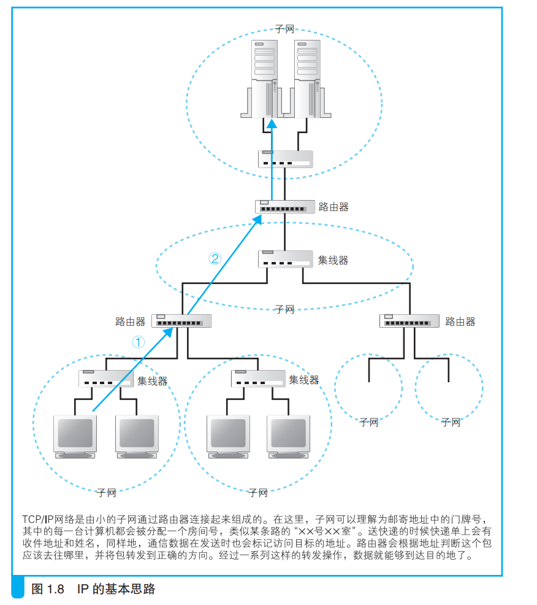
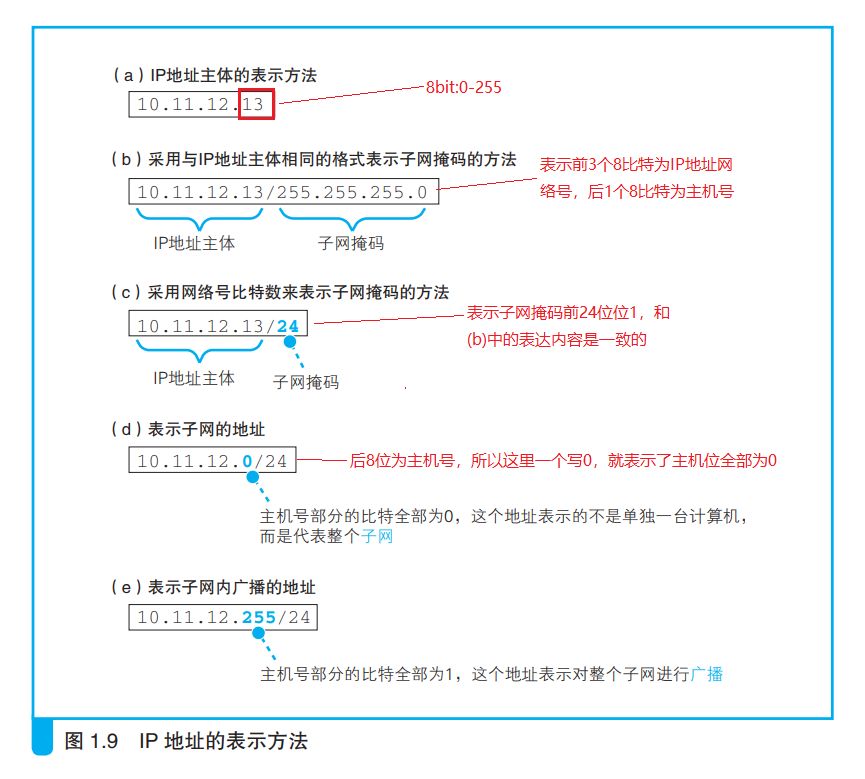
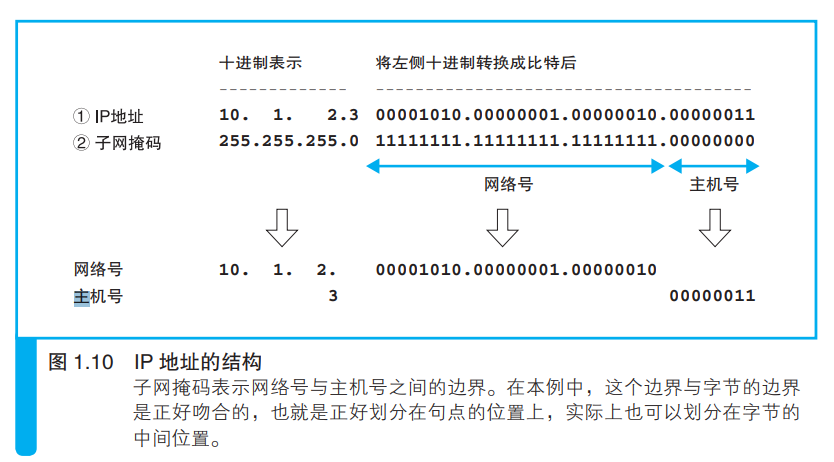
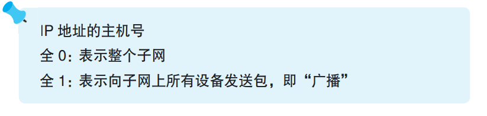
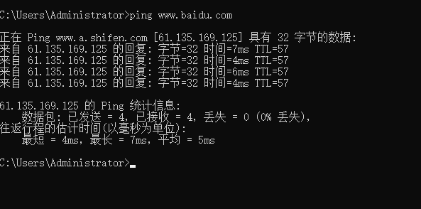
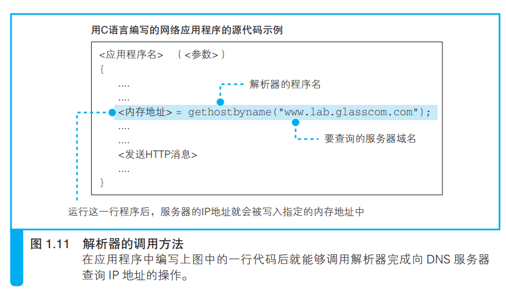
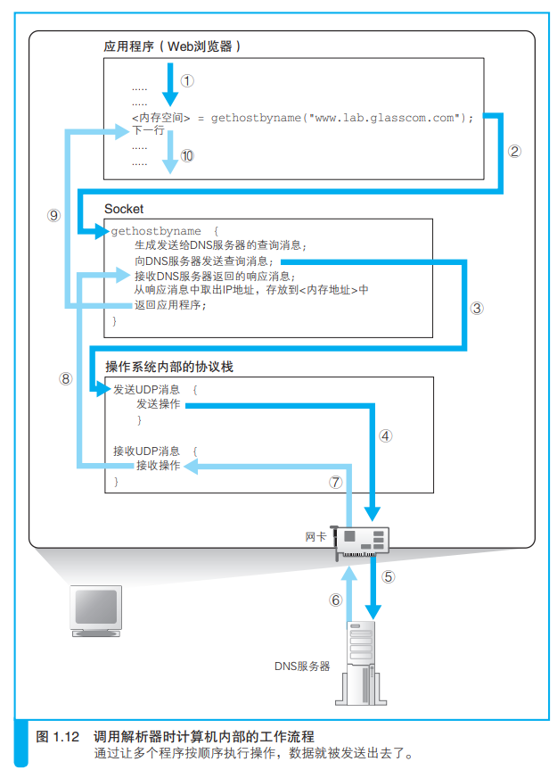
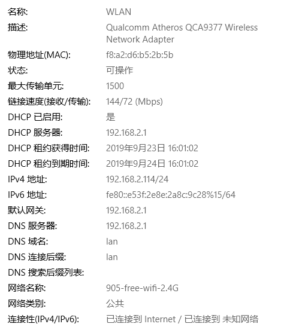

| 英文缩写 | 英文全称           | 中文含义     |
| -------- | ------------------ | ------------ |
| DNS      | Domain Name System | 域名服务系统 |
|          |                    |              |
|          |                    |              |

## 2.1 IP 地址的基本知识

&emsp;生成 HTTP 消息之后，接下来我们需要**委托操作系统**将消息发送给Web服务器。尽管浏览器能够解析网址并生成 HTTP 消息，但它本身并不具备将消息发送到网络中的功能（发送消息的功能对于所有的应用程序来说都是通用的，因此让操作系统来实现这一功能，其他应用程序委托操作系统来进行操作，这是一个比较合理的做法。），因此这一功能需要委托操作系统来实现。在进行这一操作时，我们还有一个工作需要完成，那就是查询网址中服务器域名对应的 IP 地址。**在委托操作系统发送消息时，必须要提供的不是通信对象的域名，而是它的 IP 地址**。因此，在生成 HTTP 消息之后，下一个步骤就是根据域名查询 IP 地址。在讲解这一操作之前，让我们先来简单了解一下 IP 地址。

&emsp;互联网和公司内部的局域网都是基于 TCP/IP 的思路来设计的，所以我们先来了解 TCP/IP 的基本思路。

&emsp;TCP/IP 的结构如图 1.8 所示，就是由一些小的子网，通过路由器（路由器：一种对包进行转发的设备）连接起来组成一个大的网络。这里的子网可以理解为用集线器(一种对包进行转发的设备，分为中继式集线器和交换式集线器两种)连接起来的几台计算机(当计算机数量较少时，可以用一台集线器连接起来；当计算机数量较多时，一台集线器可能无法连接这么多计算机，可以增加集线器数量并将集线器相互连接起来，这时，凡是通过集线器连接起来的所有设备都属于同一个子网)，我们将它看作一个单位，称为子网。将子网通过路由器连接起来，就形成了一个网络(一些家用路由器中已经内置了集线器功能，因此大家可以理解为这种路由器内部同时包含路由器和集线器两种设备，它们在里面已经连接起来了)。

&emsp;在网络中，所有的设备都会被分配一个地址。这个地址就相当于现实中某条路上的“×× 号 ×× 室”。其中“**号”对应的号码是分配给整个子网的，而“室”对应的号码是分配给子网中的计算机的，这就是网络中的地址。**“号”对应的号码称为网络号，“室”对应的号码称为主机号，这个地址的整体称为 IP 地址（IP 地址和现实中的地址含义是相同的，因此就像“×× 号 ×× 室”不能有两户人家的号码相同一样，也不能有两台设备使用相同的 IP 地址。现实中其实存在因为疏漏两台设备被分配了相同的 IP 地址的情况，但这种情况下网络会发生故障，无法正常工作）。通过 IP 地址我们可以判断出访问对象服务器的位置，从而将消息发送到服务器。消息传送的具体过程在后面的章节有详细讲解，不过现在我们先简单了解一下。**发送者发出的消息首先经过子网中的集线器 A，转发到距离发送者最近的路由器上（图 1.8 ①）。接下来，路由器会根据消息的目的地判断下一个路由器的位置，然后将消息发送到下一个路由器，即消息再次经过子网内的集线器被转发到下一个路由器（图 1.8 ②）。前面的过程不断重复，最终消息就被传送到了目的地。**

&emsp;前面这些就是 TCP/IP 中 IP 地址的基本思路。了解了这些知识之后，让我们再来看一下实际的 IP 地址。如图 1.9 所示：实际的 IP 地址是一串32 比特的数字，按照 8 比特（1 字节）为一组分成 4 组，分别用十进制表示，然后再用圆点隔开。这就是我们平常经常见到的 IP 地址格式，但仅凭这一串数字我们**无法区分哪部分是网络号，哪部分是主机号**。**在 IP 地址的规则中，网络号和主机号连起来总共是 32 比特，但这两部分的具体结构是不固定的**。在组建网络时，用户可以自行决定它们之间的分配关系，因此，我们还需要另外的附加信息来表示 IP 地址的内部结构。

&emsp;这一附加信息称为子网掩码。子网掩码的格式如图 1.10 ②所示，是一串与 IP 地址长度相同的 32 比特数字，其左边一半都是 1，右边一半都是0。其中，**子网掩码为 1 的部分表示网络号，子网掩码为 0 的部分表示主机**
**号。**将子网掩码按照和 IP 地址一样的方式以每 8 比特为单位用圆点分组后写在 IP 地址的右侧，这就是图 1.9（b）的方法。这种写法太长，我们也可以把 1 的部分的比特数用十进制表示并写在 IP 地址的右侧，如图 1.9（c）所示。这两种方式只是写法上的区别，含义是完全一样的。

顺带一提，主机号部分的比特全部为 0 或者全部为 1 时代表两种特殊的含义。主机号部分全部为 0 代表整个子网而不是子网中的某台设备（图1.9（d））。此外，主机号部分全部为 1 代表向子网上所有设备发送包，即广播（图 1.9（e））。

## 2.2 域名和 IP 地址并用的理由

&emsp;TCP/IP 网络是通过 IP 地址来确定通信对象的，因此不知道 IP 地址就无法将消息发送给对方，这和我们打电话的时候必须要知道对方的电话号码是一个道理。因此，在委托操作系统发送消息时，必须要先查询好对方的 IP 地址。

&emsp;可能你会问“既然如此，那么在网址中不写服务器的名字，直接写 IP地址不就好了吗？”实际上，如果用 IP 地址来代替服务器名称也是能够正常工作的（如果 Web 服务器使用了虚拟主机功能，有可能无法通过 IP 地址来访问）。然而，就像你很难记住电话号码一样，要记住一串由数字组成的 IP 地址也非常困难。因此，相比 IP 地址来说，网址中还是使用服务器名称比较好（也有人说域名也很难记啊，不过在设计 TCP/IP 架构的当时，在技术上还无法实现我们今天的搜索引擎，因此用名称来代替地址本身是有价值的）。

&emsp;如果你想查看一个网站所对应的ip地址，那么使用cmd，输入：”ping 网址“就可以知道其所对应的ip地址了：

&emsp;不过从运行效率上来看，这并不能算是一个好主意。互联网中存在无数的路由器，它们之间相互配合，根据 IP 地址来判断应该把数据传送到什么地方。那么如果我们不用 IP 地址而是改用名称会怎么样呢？ IP 地址的长度为 32 比特，也就是 4 字节，相对地，域名最短也要几十个字节，最长甚至可以达到 255 字节。换句话说，使用 IP 地址只需要处理 4 字节的数字，而域名则需要处理几十个到 255 个字节的字符，这增加了路由器的负担，传送数据也会花费更长的时间 D。可能有人会说：“那使用高性能路由器不就能解决这个问题了吗？”然而，路由器的速度是有极限的，而互联网内部流动的数据量已然让路由器疲于应付了，因此我们不应该再采用效率更低的设计。随着技术的发展，路由器的性能也会不断提升，但与此同时，数据量也在以更快的速度增长，在可预见的未来，这样的趋势应该不会发生变化。出于这样的原因，使用名称本身来确定通信对象并不是一个聪明的设计。
&emsp;于是，现在我们使用的方案是让人来使用名称，让路由器来使用 IP 地址。为了填补两者之间的障碍，需要有一个机制能够通过名称来查询 IP 地址，或者通过 IP 地址来查询名称，这样就能够在人和机器双方都不做出牺牲的前提下完美地解决问题。这个机制就是 DNS(DNS：Domain Name System，域名服务系统。将服务器名称和 IP 地址进行关联是 DNS 最常见的用法，但 DNS 的功能并不仅限于此，它还可以将邮件地址和邮件服务器进行关联，以及为各种信息关联相应的名称)。

## 2.3 Socket 库提供查询 IP 地址的功能

&emsp;查询 IP 地址的方法非常简单，只要询问最近的 DNS 服务器“www.lab.glasscom.com 的 IP 地址是什么”就可以了，DNS 服务器会回答说“该服务器的 IP 地址为 xxx.xxx.xxx.xxx”。这一步非常简单，很多读者也都很熟悉，那么浏览器是如何向 DNS 服务器发出查询的呢？让我们把向 Web服务器发送请求消息的事情放一放，先来探索一下 DNS。

&emsp;DNS 服务器发出查询，也就是向 DNS 服务器发送查询消息，并接收服务器返回的响应消息。换句话说，对于 DNS 服务器，**我们的计算机上一定有相应的 DNS 客户端**，而相当于 DNS 客户端的部分称为 DNS 解析器，或者简称解析器。通过 DNS 查询 IP 地址的操作称为域名解析，因此负责执行解析（resolution）这一操作的就叫解析器（resolver）了。

&emsp;解析器实际上是一段程序，它包含在操作系统的 Socket 库中，在介绍解析器之前，我们先来简单了解一下 Socket 库。首先，库到底是什么东西呢？库就是一堆通用程序组件的集合，其他的应用程序都需要使用其中的组件。库有很多好处。首先，使用现成的组件搭建应用程序可以节省编程工作量；其次，多个程序使用相同的组件可以实现程序的标准化。除此之外还有很多其他的好处，因此使用库来进行软件开发的思路已经非常普及，库的种类和数量也非常之多。Socket 库也是一种库，其中包含的程序组件可以让其他的应用程序调用操作系统的网络功能(Socket 库是在加州大学伯克利分校开发的 UNIX 系操作系统 BSD 中开发的 C语言库，互联网中所使用的大多数功能都是基于 Socket 库来开发的。因此，BSD 之外的其他操作系统以及 C 语言之外的其他编程语言也参照 Socket 库开
发了相应的网络库。可以说，Socket 库是网络开发中的一种标准库)，而解析器就是这个库中的其中一种程序组件。Socket 库中包含很多用于发送和接收数据的程序组件，这些功能我们暂且放一放，先来集中精力探索一下解析器。

## 2.4 通过解析器向 DNS 服务器发出查询

&emsp;解析器的用法非常简单。Socket 库中的程序都是标准组件，只要从应用程序中进行调用就可以了。具体来说，在编写浏览器等应用程序的时候，只要像图 1.11 这样写上解析器的程序名称“gethostbyname”以及 Web 服务器
的域名“www.lab.glasscom.com”就可以了，这样就完成了对解析器的调用(实际上，除此之外还需要编写一些用于分配保存 IP 地址的内存空间的语句，并在程序开头使用 #include 命令将其包含进来)。

## 2.5 解析器的内部原理

&emsp;下面来看一看当应用程序调用解析器时，解析器内部是怎样工作的（图 1.12）。网络应用程序（在我们的场景中就是指浏览器）调用解析器时，程序的控制流程就会转移到解析器的内部。“控制流程转移”这个说法对于没有编程经验的人来说可能不容易理解，所以这里简单解释一下。

&emsp;顺带一提，向 DNS 服务器发送消息时，我们当然也需要知道 DNS 服务器的 IP 地址。只不过这个 IP 地址是作为 TCP/IP 的一个设置项目事先设置好的，不需要再去查询了。不同的操作系统中 TCP/IP 的设置方法也有差异，Windows 中的设置如图 1.13 所示，解析器会根据这里设置的 DNS 服务器 IP 地址来发送消息。

