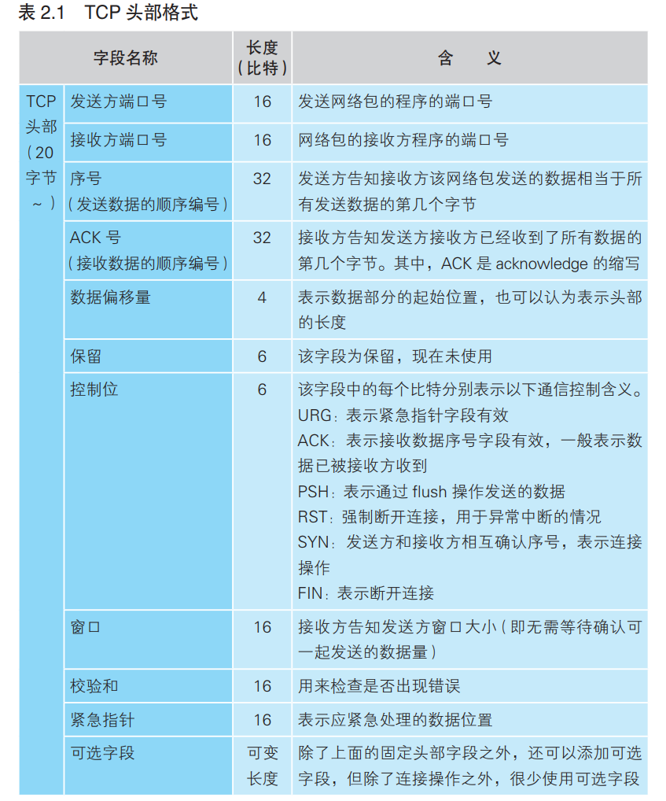
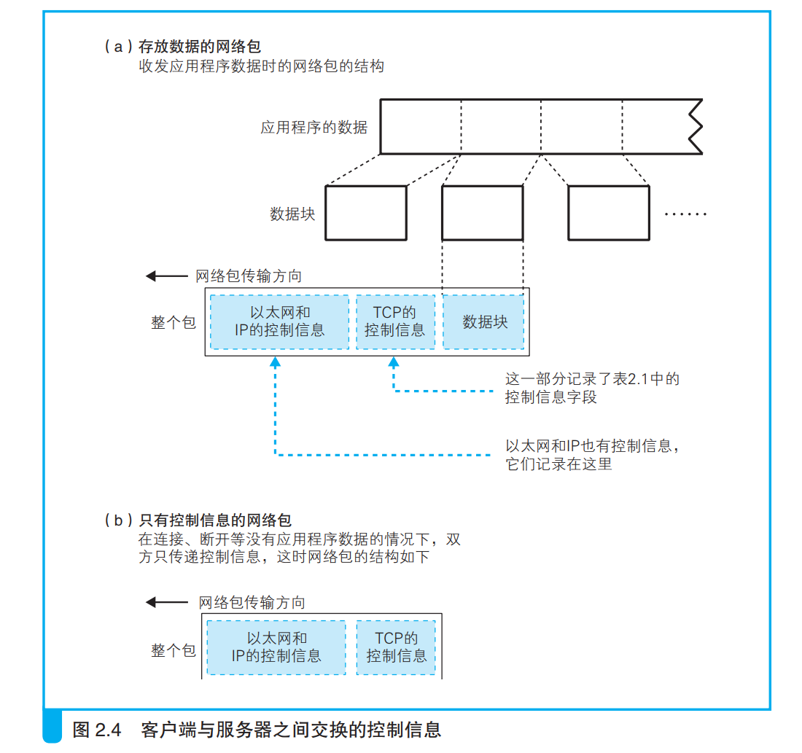
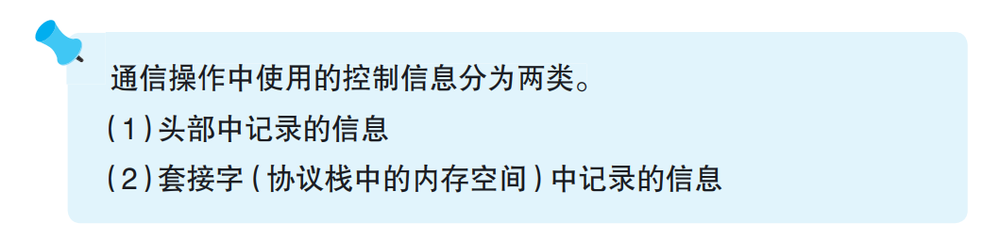

# 第六章 连接服务器

## 一、连接是什么意思

&emsp;创建套接字之后，应用程序（浏览器）就会调用 connect，随后协议栈 会将本地的套接字与服务器的套接字进行连接。话说，以太网的网线都是一直连接的状态，我们并不需要来回插拔网线，那么这里的“连接”到底 是什么意思呢？**连接实际上是通信双方交换控制信息，在套接字中记录这些必要信息并准备数据收发的一连串操作**，在讲解具体的过程之前，我们 先来说一说“连接”到底代表什么意思。

&emsp;网线是一直连接着的，随时都有信号从中流过，如果通信过程只是将数据转换为电信号，那么这一操作随时都可以进行。不过，在这个时间点， 也就是套接字刚刚创建完成时，当应用程序委托发送数据的时候，协议栈会如何操作呢？

&emsp;套接字刚刚创建完成的时候，里面并没有存放任何数据，也不知道通信的对象是谁。在这个状态下，即便应用程序要求发送数据，协议栈也不 知道数据应该发送给谁。浏览器可以根据网址来查询服务器的 IP 地址，而且根据规则也知道应该使用 80 号端口，但只有浏览器知道这些必要的信息是不够的，因为在调用 socket 创建套接字时，这些信息并没有传递给协议栈。因此，**我们需要把服务器的 IP 地址和端口号等信息告知协议栈，这是连接操作的目的之一**。

&emsp;那么，服务器这边又是怎样的情况呢？服务器上也会创建套接字(服务器程序一般会在系统启动时就创建套接字并等待客户端连接)，但服务器上的协议栈和客户端一样，只创建套接字是不知道应该和谁进行通信的。而且，和客户端不同的是，在服务器上，连应用程序也不知道通信对象是谁，这样下去永远也没法开始通信。于是，我们需要让客户端向服务器告知必要的信息，比如“我想和你开始通信，我的 IP 地址是 xxx.xxx. xxx.xxx，端口号是 yyyy。”可见，**客户端向服务器传达开始通信的请求， 也是连接操作的目的之一**(否则服务器是不能够知晓和哪一个客户端进行通信的)。

&emsp;之前我们讲过，连接实际上是通信双方交换控制信息，在套接字中记录这些必要信息并准备数据收发的一连串操作，像上面提到的客户端将 IP 地址和端口号告知服务器这样的过程就属于交换控制信息的一个具体的例子。**所谓控制信息，就是用来控制数据收发操作所需的一些信息，IP 地址和端口号就是典型的例子**。除此之外还有其他一些控制信息，我们后面会逐一进行介绍。连接操作中所交换的控制信息是根据通信规则来确定的， 只要根据规则执行连接操作，双方就可以得到必要的信息从而完成数据收发的准备。此外，当执行数据收发操作时，我们还需要一块用来临时存放要收发的数据的内存空间，这块内存空间称为缓冲区，它也是在连接操作的过程中分配的。上面这些就是“连接”这个词代表的具体含义。

注释：

&emsp;使用“连接”这个词是有原因的。通信技术的历史已经有 100 多年，从通 信技术诞生之初到几年之前的很长一段时间内，电话技术一直都是主流。 而电话的操作过程分为三个阶段：（1）拨号与对方连接；（2）通话；（3）挂 断。人们将电话的思路套用在现在的计算机网络中了，所以也就自然而然地将通信开始之前的准备操作称为“连接”了。如果没有这段历史的话，说不定现在我们就不叫“连接”而是叫“准备”了。因此，如果觉得“连接”这个词听起来有些怪，那么用“准备”这个词来替换也问题不大。

**所以连接的内层含义即：准备**。

## 二、负责保存控制信息的头部

&emsp;关于控制信息，这里再补充一些。之前我们说的控制信息其实可以大体上分为两类。

&emsp;第一类是客户端和服务器相互联络时交换的控制信息。这些信息不仅连接时需要，包括**数据收发和断开连接操作在内，整个通信过程中都需要**， 这些内容在 TCP 协议的规格中进行了定义。具体来说，表 2.1 中的这些字段就是 TCP 规格中定义的控制信息(这张表中只列出了必需字段，TCP 协议规格中还定义了另外一些可选字段)。这些字段是固定的，在连接、收发、 断开等各个阶段中，每次客户端和服务器之间进行通信时，都需要提供这些控制信息。具体来说，如图 2.4（a）所示，这些信息会被添加在客户端与服务器之间传递的网络包的开头。在连接阶段，由于数据收发还没有开始， 所以如图 2.4（b）所示，网络包中没有实际的数据，只有控制信息。**这些控制信息位于网络包的开头，因此被称为头部**。此外，以太网和 IP 协议也有自己的控制信息，这些信息也叫头部，为了避免各种不同的头部发生混淆， 我们一般会记作 TCP 头部、以太网头部(以太网头部又称“MAC 头部”)、IP 头部。 客户端和服务器在通信中会将必要的信息记录在头部并相互确认，例如下面这样。

发送方：“开始数据发送。”
接收方：“请继续。”
发送方：“现在发送的是 ×× 号数据。”
接收方：“×× 号数据已收到。”
……（以下省略）

&emsp;正是有了这样的交互过程，双方才能够进行通信。**头部的信息非常重要，理解了头部各字段的含义，就等于理解了整个通信的过程**。在后面介绍协议栈的工作过程时，我们将根据需要讲解头部各字段的含义，现在大家只要先记住**头部是用来记录和交换控制信息**的就可以了。

&emsp;上表中，不算可选字段，一共使用156比特,而20字节为160比特。

&emsp;控制信息还有另外一类，那就是保存在套接字中，**用来控制协议栈操作的信息**（前面已经讲过，这些信息保存在协议栈中的套接字内存空间中）。**应用程序传递来的信息以及从通信对象接收到的信息都会保存在这里，还有收发数据操作的执行状态等信息也会保存在这里，协议栈会根据这些信息来执行每一步的操作**。我们可以说，套接字的控制信息和协议栈的程序本身其实是一体的，因此，“协议栈具体需要哪些信息”会根据 协议栈本身的实现方式不同而不同（无论协议栈的实现如何不同，IP 地址和端口号这些重要的信息都是共通的），但这并没有什么问题。因为协议栈中的控制信息通信对方是看不见的，只要在通信时按照规则将必要的信息写入头部，客户端和服务器之间的通信就能够得以成立。例如，**Windows 和 Linux 操作系统的内部结构不同，协议栈的实现方式不同，必要的控制信息也就不同**。但即便如此，两种系统之间依然能够互相通信，同样地，计算机和手机之间也能够互相通信。正如前面所说，协议栈的实现不同，因此我们无法具体说明协议栈里到底保存了哪些控制信息，但可以用命令来 显示一些重要的套接字控制信息（图 2.2），这些信息无论何种操作系统的协议栈都是共通的，通过理解这些重要信息，就能够理解协议栈的工作方式了。

## 三、连接操作的实际过程

&emsp;我们已经了解了连接操作的含义，下面来看一下具体的操作过程。这 个过程是从应用程序调用 Socket 库的 connect 开始的（图 2.3 ②）。

`connect（< 描述符 >, < 服务器 IP 地址和端口号 >, …）`

&emsp;上面的调用提供了服务器的 IP 地址和端口号，这些信息会传递给协议栈中的 TCP 模块。然后，TCP 模块会与该 IP 地址对应的对象，也就是与服务器的 TCP 模块交换控制信息，这一交互过程包括下面几个步骤。

1. 首先，客户端先创建一个包含表示开始数据收发操作的控制信息的头部。如表 2.1 所示，头部包含很多字段，这里要关注的重点是发送方和接收方的端口号。到这里，客户端（发送方）的套接字就准确找到了服务器（接收 方）的套接字，也就是搞清楚了我应该连接哪个套接字。
2. 然后，我们将头部中的控制位的 SYN 比特设置为 1，大家可以认为它表示连接(SYN 比特的含义我们将在后面介绍序号时讲解)。
3. 此外还需要设置适当的序号和窗口大小，这一点我们会稍后详细讲解(窗口大小就是告诉对方：我给你留下这么大的缓冲区，我一次最多能接收这么多的数据)。

**连接操作的第一步是在 TCP 模块处创建表示连接控制信息的头部。**

**通过 TCP 头部中的发送方和接收方端口号可以找到要连接的套接字。**

&emsp;**当 TCP 头部创建好之后，接下来 TCP 模块会将信息传递给 IP 模块并委托它进行发送**(IP 模块接到委托并发送网络包的实际操作过程我们将稍后讲解)。IP 模块执行网络包发送操作后，网络包就会通过网络到到端口号对应的套接字，也就是说，从处于等待连接状态的套接字中找到与 TCP 头部中记录的端口号相同的套接字就可以了。当找到对应的套接字之后，套接字中会写入相应的信息，并将状态改为正在连接(与此相关的操作我们将在第 6 章探索服务器内部时讲解)。上述操作完成后，服务器的 TCP 模块会返回响应，这个过程和客户端一样，需要在 TCP 头部中设置发送方和接收方端口号以及 SYN 比特(如果由于某些原因不接受连接，那么将不设置 SYN，而是将 RST 比特设置为 1)。此外，在返回响应时还需要将 ACK 控制位设为 1(客户端向服务器发送第一个网络包时，由于服务器还没有接收过网络包，所以需要将 ACK 比特设为 0)，这表示已经接收到相应的网络包。网络中经常会发生错误，网络包也会发生丢失，因此双方在通信时必须相互确认网络包是否已经送达(相互确认的具体过程我们将稍后讲解)，而设置 ACK 比特就是用来进行这一确认的。接下来，服务器 TCP 模块会将 TCP 头部传递给 IP 模块，并委托 IP 模块向客户端返回响应。

&emsp;然后，网络包就会返回到客户端，通过 IP 模块到达 TCP 模块，并通过 TCP 头部的信息确认连接服务器的操作是否成功。如果 SYN 为 1 则表示连接成功，这时会向套接字中写入服务器的 IP 地址、端口号等信息，同时还会将状态改为连接完毕。到这里，客户端的操作就已经完成，但其实还 剩下最后一个步骤。刚才服务器返回响应时将 ACK 比特设置为 1，相应地， 客户端也需要将 ACK 比特设置为 1 并发回服务器，告诉服务器刚才的响应包已经收到。当这个服务器收到这个返回包之后，连接操作才算全部完成。 现在，套接字就已经进入随时可以收发数据的状态了，大家可以认为这时有一根管子把两个套接字连接了起来。当然，实际上并不存在这么一 根管子，不过这样想比较容易理解，网络业界也习惯这样来描述。这根管子，我们称之为连接(这里的“连接”是一个名词，对应英文的 Connection。也有人把连接称为“会话”（session），它们的意思大体上相同)。只要数据传输过程在持续，也就是在调用 close 断开之前，连接是一直存在的。 建立连接之后，协议栈的连接操作就结束了，也就是说 connect 已经执行完毕，控制流程被交回到应用程序。

&emsp;至此，我们至少可以认识到TCP模块和IP模块的一个区别，前者主要目的是为了实现形成一个TCP头部，用于记录和交换控制信息，并且响应别人的TCP头部。而TCP头部在TCP模块中形成之后，就需要借助IP模块进行传输。

